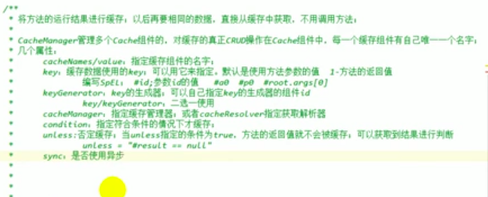
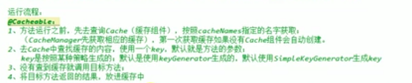
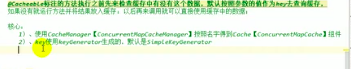

# SpringBoot 与 缓存
> JSP-107 ***Spring缓存抽象*** 整合redis

## JSR-107
```text
CachingProvider 
CacheManager  pool
Cache         conn
key-value
```
## Spring缓存抽象
> org.springframework.cache.Cache  conn
> org.springframework.cache.CacheManager pool  
> 简化缓存技术

### 概念和注解
> Cache 缓存接口，定义缓存操作。实现悠RedisCache ConcurrnetMapCache等
> CacheManage 缓存管理器，管理各种缓存组件
> @Cacheable 主要针对配置，根据方法的请求参数，对结果进行缓存   key:可以使用SpEL #id  key/keygenerator二选一
> @CacheEvict 清空缓存
> CachePut 更新缓存
> EnableCaching 开启注解缓存
>keyGenerator 缓存数据时key生成策略
>serialize 缓存数据时value序列化策略
```text
mybitis 如果获取的数据不存在时，可以通过设置开启陀峰命名规则。
```





## 整合redis
* [仓库加速](https://www.docker-cn.com/registry-mirror)

* ` docker run -d -p 6379:6379 --name=myredis registry.docker-cn.com/library/redis `

* 是在application.properites的redis配置中的spring.redis.timeout中连接超时时间（毫秒）中时间设置不能为0

## ES

* docker run -e ES_JAVA_OPTS="-Xms256m -Xmx256m" -d -p 9200:9200 -p 9300:9300 --name ES01 5acf0e8da90b